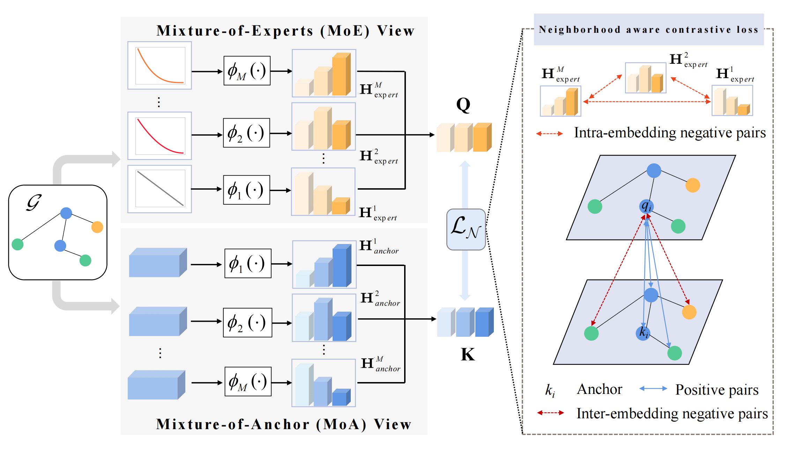

#LMAMoE: Learnable model augmentation for graph contrastive learning via mixture-of-experts
Pytorch implementation for the paper "LMAMoE: Learnable model augmentation for graph contrastive learning via mixture-of-experts".

## Abstract
Graph Contrastive Learning (GCL) has demonstrated superior performance in self-supervised graph representations. GCL aims at maximizing/minimizing the similarity of positive pairs and negative pairs. In traditional methods, node-to-node alignment is applied as positive pairs are generated from different views of the same node, and negative pairs are typically obtained from different instances. However, there are many false negative pairs exist as the connected nodes often share similar semantic in graphs which should be positive pairs. Besides, GCL methods overlook the embedding diversity since only one subspace is utilized in constructing augmentation views. To address these issues, we propose a Learnable Model Augmentation framework via Mixture-of-Experts (LMAMoE). To improve the embedding diversity, we conduct contrastive learning between Mixture-of-Anchors (MoA) and Mixture-of-Experts (MoE) views. Specifically, MoA conducts multiply subspaces via multiply Feed-Forward Networks (FFN) to obtain some ego-embeddings. And the final anchor embedding are obtained by the concatenate of different ego-embeddings. Based on spectrum theory, MoE applies a fixed low-pass filter to act as an expert in each separate pipeline, and then combines the experts ability. To avoid the false-negative samples, we propose a neighborhood contrastive loss. Apart of taking the instance in the other view as positive samples, the samples in the neighborhood of anchor also termed as positive pairs. We state the theory principles via expanding node-to-node alignment to node-to-neighborhood alignment and meeting the requirements of uniformity. Experiments demonstrate that LMAMoE achieves state-of-the-art classification accuracy and significantly enhances embedding diversity. 



## Training LMAMoE
Taking the dataset pubmed as an example, run the following command to obtain the experimental results:
    
    python trainmodelaug.py   --dataset  Photo    

##  Baselines

Traditional methods. We employ 3 traditional methods including  Node2vec, DeepWalk, and LINE. These methods belong to shallow models as they did not utilize the idea of deep learning. 

Data augmentation. We apply 6 data augmentation works including DGI, GraphCL,  COLES, GGD , GRACE  and MVGRL. As a key part of the contrastive field, these methods tend to employ various ad-hoc strategies to generate augmented graphs for shared-weighted contrastive frameworks. 

Model augmentation. We apply 3 model augmentation methods including SUGRL, BGRL, and MAGCL. 
## Codes and datasets
The implementation of this code is largely built upon [MVGRL](https://github.com/kavehhassani/mvgrl) 


## Citation
```bibtex

```